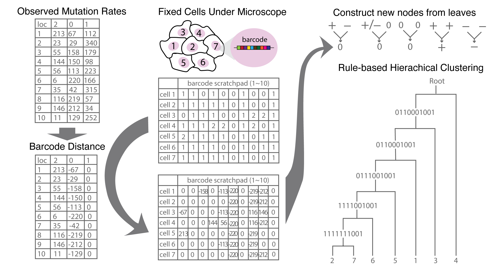

# Rule-based Hierachical Clustering for Cell Linage Reconstruction
Hanrui Zhang (rayezh@umich.edu) and Yuanfang Guan (gyuanfan@umich.edu)

This is team Guan&Zhang's submission to [Allen Institute Cell Lineage Reconstruction DREAM Challenge](https://www.synapse.org/#!Synapse:syn20692755/wiki/).

## Overview
Our method in subchallenge 1 was based on:
1) distance transformation,
2) rule based hierarchical clustering based on minimal distance
as described in the following figure.

Figure 1. Workflow of Guanlab’s method in Subchallenge 1.


First of all,  we summarized the frequency of different edition states of the 10 barcodes based on the training set (right panel in Figure 1). The more frequent edition states should be assigned less importance, therefore we assign larger distances. The edition states of the barcode 1-10 is in the Barcode distance table (Figure 1).
Then, we start to reconstruct the lineage tree for every training dataset. First for every group of cells we need to reconstruct the lineage tree, we transform their edition status according to the Barcode Distance table (middle panel in Figure 1).  Then the transformed edition status are sent for hierarchical clustering, where the two cells with minimal distances are clustered together, and the parent cell of the two cells are deduced based on the irreversible edition rules (“Constructed new nodes from leaves” in Figure 1). The hierarchical clustering stops until there’s only one node left for the whole cell set therefore no more cells left for clustering.
## Dependencies
Before you start, make sure the following dependencies have been installed:
* [Python (3.0 or later)](https://www.python.org/download/releases/3.0/)
* [DendroPy](https://dendropy.org)
* [BioPython (1.78)](https://biopython.org/wiki/Download)
* [Numpy (1.19.5)](https://numpy.org/install/)
* [Pandas (0.25.1)](https://pandas.pydata.org/pandas-docs/stable/getting_started/install.html)

## Usage
To reproduce Guan&Zhang's submission for SubChallenge1:
```
python train.py [INPUT PATH]
```


